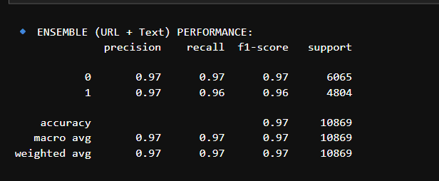
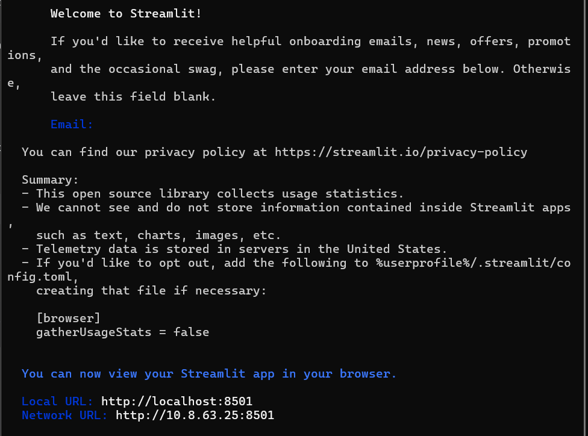
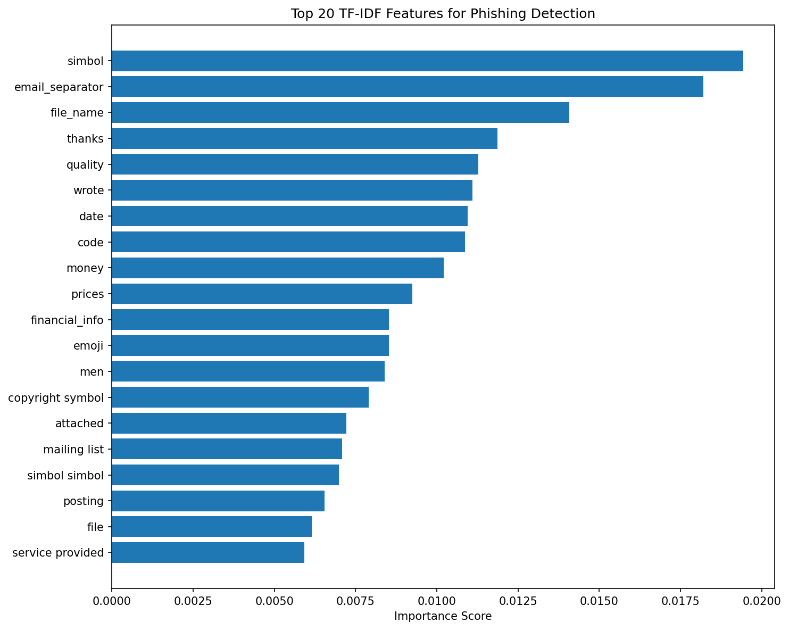
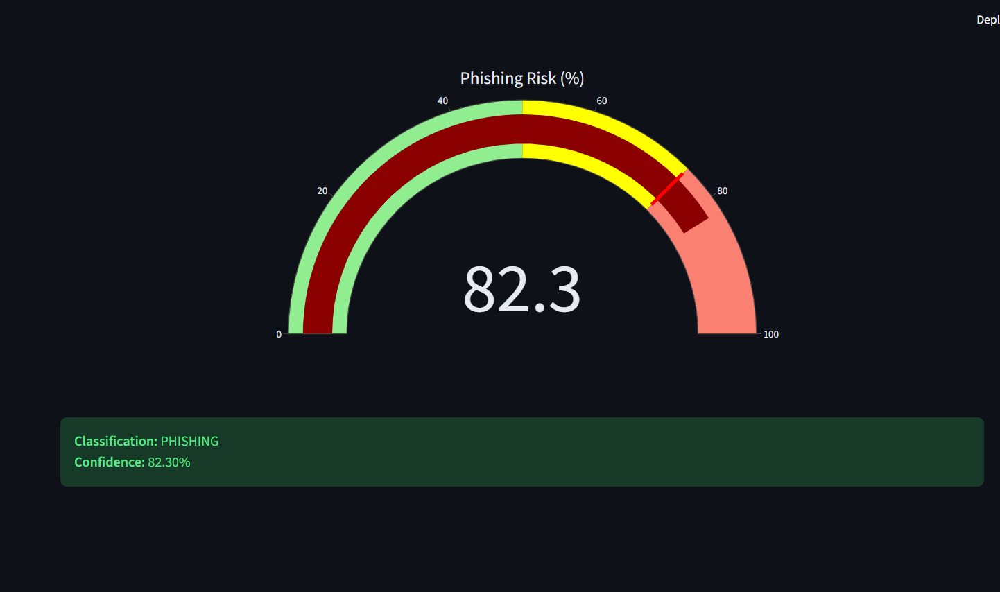

# Multimodal Phishing Detection System

[](https://www.python.org/downloads/)
[](https://fastapi.tiangolo.com)
[](https://streamlit.io)
[](https://xgboost.ai)

A **production‑ready, multimodal AI system** that detects phishing emails and URLs with **97% accuracy**.  
Combines **URL lexical features (XGBoost)** + **email text (TF‑IDF + XGBoost)** → **stacked ensemble** for robust, real‑time inference.

---

##  **Screenshots & Demo**

| **Model Performance** | **Live API** | 
|----------------------|--------------|
|  |  |

**Feature Importance**

| **Top 20 TF-IDF Features**| **Detection Demo** |
|----------------------|--------------|
|  |  |


---

##  **Key Features**

- ✅ **Multimodal fusion** – URL structure + email text  
- ✅ **XGBoost on 4 lexical features** – `url_count`, `url_length_max`, `url_subdom_max`, `attachment_count`  
- ✅ **TF‑IDF + XGBoost on email body** – captures linguistic phishing cues  
- ✅ **Stacked ensemble (Logistic Regression)** – F1 **0.96–0.97** on test set  
- ✅ **FastAPI backend** – low‑latency predictions  
- ✅ **Streamlit dashboard** – interactive risk gauge, real‑time feedback  
- ✅ **Explainability** – top TF‑IDF feature importance chart  

---

##  **Dataset**

- **MeAJOR Corpus v2.0** (Zenodo) – 108k+ emails, 41 pre‑engineered features, anonymized.  
- 80/10/10 stratified split → 86,947 train / 10,868 val / 10,869 test.

---

## **Model Architecture**
```
┌─────────────────┐ ┌─────────────────┐
│ URL Features │ │ Email Text │
│ (4 numerical) │ │ (raw string) │
└────────┬────────┘ └────────┬────────┘
│ │
▼ ▼
┌─────────────────┐ ┌─────────────────┐
│ XGBoost (URL) │ │ TF‑IDF + XGB │
│ (trained) │ │ (trained) │
└────────┬────────┘ └────────┬────────┘
│ │
└───────────┬───────────┘
▼
┌─────────────────────┐
│ Meta‑Learner (LR) │
│ probability stack │
└────────┬──────────┘
▼
┌─────────────┐
│ PHISHING / │
│ BENIGN │
└─────────────┘
```

---

## **Installation & Setup**

### 1️⃣ Clone the repository
```bash
git clone https://github.com/yourusername/AI-Phishing-Detection.git
cd AI-Phishing-Detection
```
### 2️⃣ Create and activate virtual environment
```bash
python -m venv phishing_venv
# Windows
phishing_venv\Scripts\activate
# Linux/macOS
source phishing_venv/bin/activate
```
### 3️⃣ Install dependencies
```bash
pip install -r requirements.txt
```

---

## Quick Start

- Start the API server
```bash
python -m uvicorn api.main:app --reload --host 0.0.0.0 --port 8000
```
- Start the Streamlit dashboard (new terminal)
```bash
python -m streamlit run dashboard/app.py
```
Open http://localhost:8501 in your browser.

---

## Test with Sample Phishing Email
Email text:
```
Subject: Urgent: Your account will be suspended

Dear valued customer,

We detected unusual activity on your PayPal account. 
To prevent suspension, please verify your information immediately:

http://paypal-security-verify.com.login.temporary-server.net/update

Failure to do so within 24 hours will result in permanent account limitation.

Sincerely,
PayPal Security Team
```
- URL features: 1, 85, 3, 0
- Prediction: PHISHING (≈97% confidence)

---

## Performance


🗂️ Project Structure
```text
AI-Phishing-Detection/
│
├── api/                # FastAPI backend
│   └── main.py
├── dashboard/          # Streamlit frontend
│   └── app.py
├── models/             # Trained models
│   ├── xgboost_model.json
│   ├── tfidf_vectorizer.pkl
│   ├── xgboost_text_model.json
│   └── meta_learner.pkl
├── notebooks/          # Jupyter training notebooks
│   ├── 01_data_preparation.ipynb
│   └── 02_model_training.ipynb
├── screenshots/        # Demo images for README
├── requirements.txt
└── README.md
```
